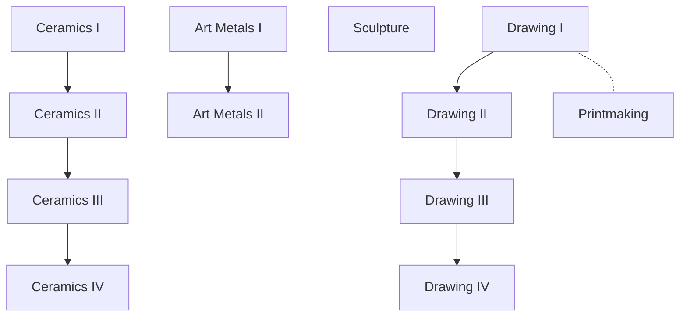

## Why Study Art?

All students can benefit from art education. At Sun Prairie High Schools, we offer a wide variety of challenging art courses to help
you discover, develop, and appreciate individual creative talents in the visual arts. Knowledge and experience of art and design is a
vital part of a growing number of careers you may be interested in for your future. Art classes will:

- Allow learners to express themselves creatively.
- Promote individuality, bolster self-confidence, and improve overall academic performance.
- Help all students develop more appreciation and understanding of the world around them.
- Help students develop a sense of craftsmanship, quality task performance, and goal-setting skills needed to succeed in the classroom and beyond.
- Strengthen student problem-solving and critical thinking skills, adding to overall academic achievement and school success.

## Courses Flowchart

## Course Table

