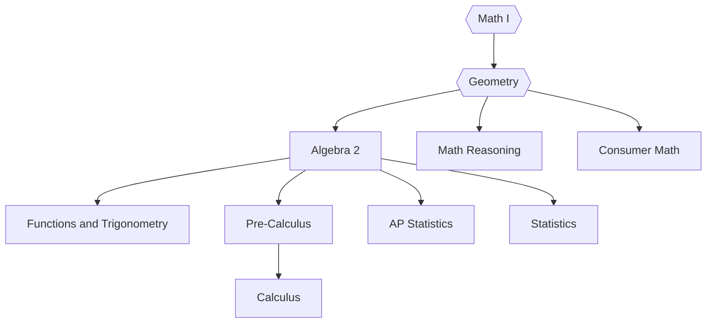

## Mission Statement

To strengthen all students’ natural curiosity as problem-solvers by developing mathematical skills and authentic connections in mour classroom and to our world.

## Courses Flowchart

## Studying Math at Sun Prairie High Schools

The department encourages all students to take four years of math. Studies have shown that students do significantly better in post-secondary mathematics courses if they have taken a math class every year of their secondary education. All students need 3 credits of math to graduate. Mathematics is an essential tool in many fields including the trades, fine arts, family and consumer sciences, natural science, engineering, medicine, and the social sciences. The purpose of our math curricula is to provide all students with the opportunity to be successful at their current level of math development and to enable them to progress in their mathematical knowledge. The curricula we offer is comprehensive and due to math’s sequential nature, it is important that you plan your complete math program to avoid scheduling conflicts. **Students taking Pre-Calculus, AP Calculus, AP Statistics, and Statistics may want to purchase their own graphics calculator (TI-83 or TI-84 series is recommended). All other classes will use a scientific calculator.**

The K-12 district math curricula fosters independent thinkers who can work collaboratively to analyze problems and explain or justify their thinking. Our math department focuses on helping students understand not just the hows of math, but also the whys. Our materials align with our adopted Wisconsin Standards for Mathematics and have met all the critical benchmarks for fostering academic excellence in mathematics.

Colleges, universities, and vocational schools all have different entrance requirements. Students should meet with their counselor, speak with college admissions officers or go online to view specific math requirements.